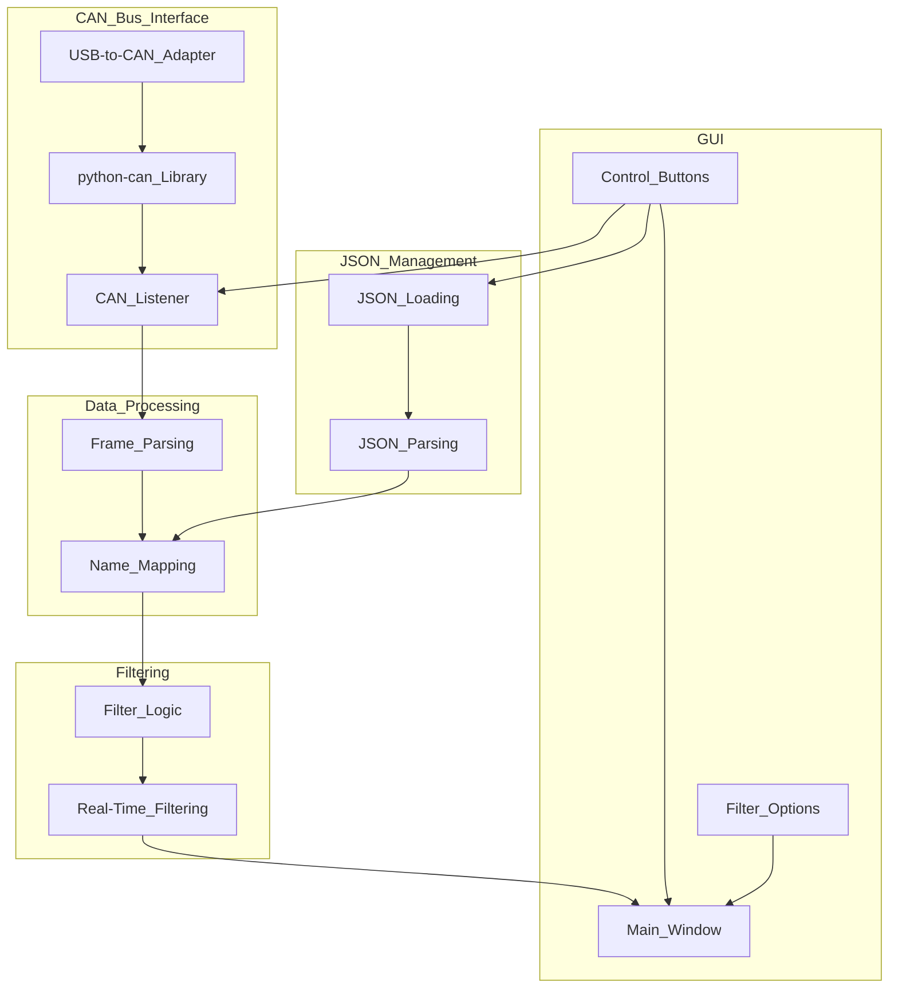

# wellington
Develop CAN Bus GUI Application with Python Tkinter

- # The architecture of the CAN Bus GUI application can be divided into the following components:
- ### CAN Bus Interface
	- This component is responsible for interfacing with the CAN bus hardware and capturing the CAN frames.
	- **Hardware Interface**: The application will use a USB-to-CAN adapter to connect to the CAN bus.
	- **CAN Library**: The `python-can` library will be used to interface with the CAN bus. This library provides a high-level API for sending and receiving CAN messages.
	- **CAN Listener**: A listener will be implemented to capture CAN frames in real-time. The listener will run in a separate thread to ensure that the GUI remains responsive.
- ### Data Processing
	- This component processes the captured CAN frames and prepares them for display in the GUI.
	- **Frame Parsing**: The raw CAN frames will be parsed to extract relevant information such as frame ID, data, and timestamp.
	- **Name Mapping**: The frame ID will be used to look up the name and type of the frame from the JSON file.
- ### JSON Management
	- This component manages the JSON file that contains the mappings of frame IDs to their corresponding names and types.
	- **JSON Loading**: The JSON file will be loaded at the start of the application. The user will also have the option to load a new JSON file dynamically.
	- **JSON Parsing**: The JSON data will be parsed and stored in a dictionary for quick lookup.
- ### GUI
	- This component provides the graphical user interface using Python Tkinter.
	- **Main Window**: The main window will contain a list view to display the CAN frames.
	- **Control Buttons**: Buttons will be provided to start and stop CAN bus listening, load the JSON file, and apply filters.
	- **Filter Options**: A filter input field will allow users to filter the CAN frames by sender name.
- ### Filtering
	- This component provides real-time filtering of the displayed CAN frames.**
	- Filter Logic**: The filtering will be based on the sender name, which is fetched from the JSON file using the frame ID.**
	- Real-Time Filtering**: The filter will be applied in real-time as the frames are captured and processed.
- The following diagram illustrates the overall architecture

